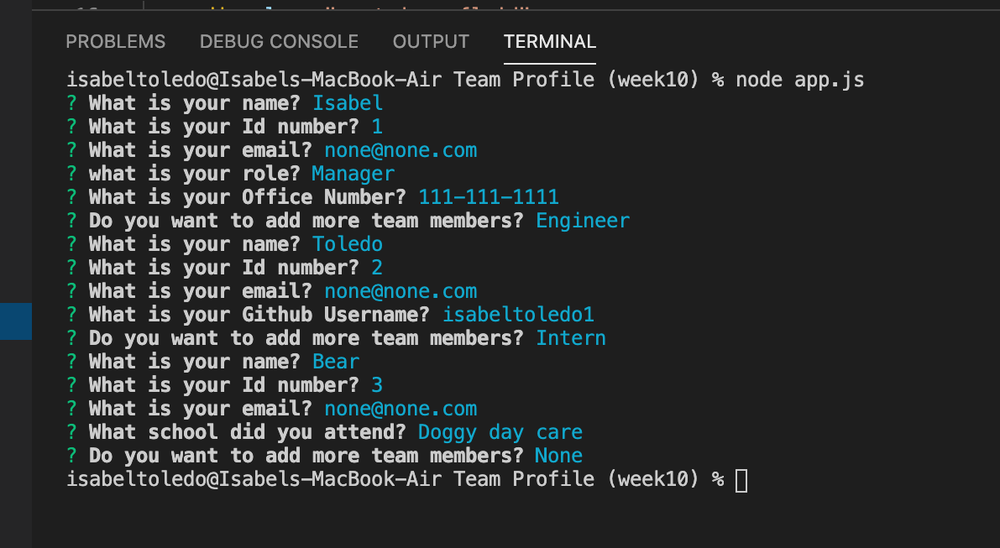
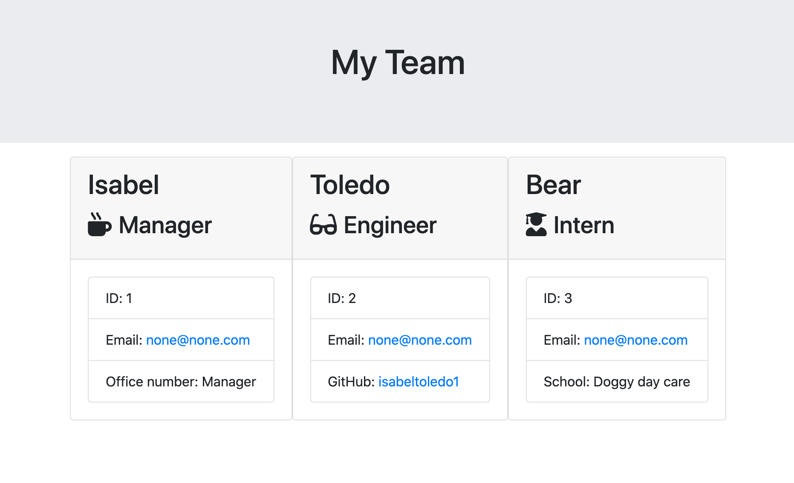

# Team Profile Generator


### Desription

A node.js app that will allow the user to follow a series of questions to add their team members to an html file. 

  

  

    
 


### Installation
```
npm i to install necessary dependencies 
```

### Instructions
to run app, run command line "node app.js", answer the promps to add team members to your team roster. 


### Technologies Used:
 - HTML
 - CSS
 - JavaScript 
 - Node
 - Inquirer package
 - Jest for testing 


 


